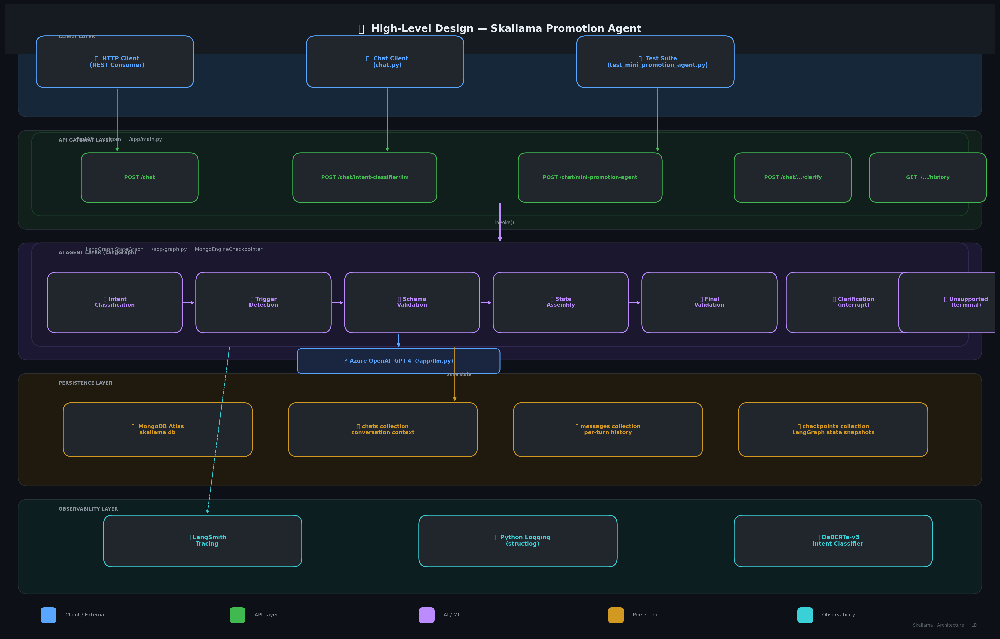

# High-Level Design — Skailama Promotion Agent

## Overview

The Skailama Promotion Agent is a **FastAPI + LangGraph** service that converts free-text merchant promotion requests into validated structured promotion configurations. It is composed of five logical layers:

---

## Layer Breakdown

### 1. Client Layer
| Client | Description |
|--------|-------------|
| HTTP Client | Any REST consumer hitting the FastAPI endpoints |
| `chat.py` | Interactive CLI chat client for manual testing |
| `test_mini_promotion_agent.py` | Automated test suite (pytest) for the promotion agent API |

---

### 2. API Gateway Layer (`/app/main.py`)
FastAPI application running via **uvicorn**. Startup verifies all three external services before accepting traffic.

| Endpoint | Purpose |
|----------|---------|
| `POST /chat` | Raw echo endpoint (Azure OpenAI ping) |
| `POST /chat/intent-classifier/llm` | Standalone LLM-based intent classification |
| `POST /chat/mini-promotion-agent` | **Primary** — runs the full LangGraph pipeline |
| `POST /chat/mini-promotion-agent/clarify` | Resume a paused clarification graph |
| `GET /chat/mini-promotion-agent/{thread_id}/history` | Retrieve conversation history |

---

### 3. AI Agent Layer (`/app/graph.py`, `/app/nodes.py`)
A **LangGraph `StateGraph`** with 7 nodes, compiled with the `MongoEngineCheckpointer` for durable state persistence across HTTP calls.

| Node | Role |
|------|------|
| `intent_classification_node` | Classify user intent via LLM |
| `trigger_detection_node` | Extract tier triggers & rewards via LLM |
| `schema_validation_node` | Pydantic-validate every tier (trigger + reward) |
| `state_assembly_node` | Assemble final state fields |
| `validation_node` | Cross-validate intent ↔ promotion structure |
| `clarification_node` | Human-in-the-loop pause via `interrupt()` |
| `unsupported_node` | Terminal node for unsupported intents |

---

### 4. Persistence Layer (`/app/db/mongo.py`, `/app/mongo_checkpointer.py`)
| Store | Collection | Content |
|-------|-----------|---------|
| MongoDB Atlas | `chats` | Conversation context & metadata |
| MongoDB Atlas | `messages` | Per-turn message history (role + content + ui) |
| MongoDB Atlas | `checkpoints` | LangGraph state snapshots (via `MongoEngineCheckpointer`) |
| MongoDB (Development) | `licenses` | License key lookup |

---

### 5. Observability Layer
| Component | Purpose |
|-----------|---------|
| **LangSmith** | Distributed tracing of every LLM call and graph node (`@traceable`) |
| **Python logging** | Structured INFO/ERROR logs at every critical path |
| **DeBERTa-v3-small** | Local intent classifier for pre-classification validation & evaluation |

---

## External Dependencies
- **Azure OpenAI (GPT-4)** — All LLM calls routed through `/app/llm.py`
- **MongoDB Atlas** — Durable conversation & checkpoint storage
- **LangSmith** — Optional trace observability
