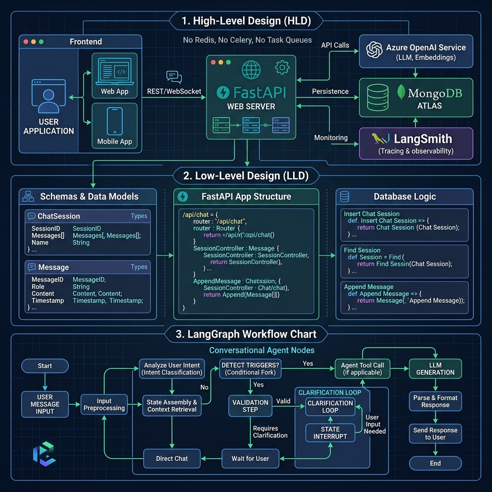
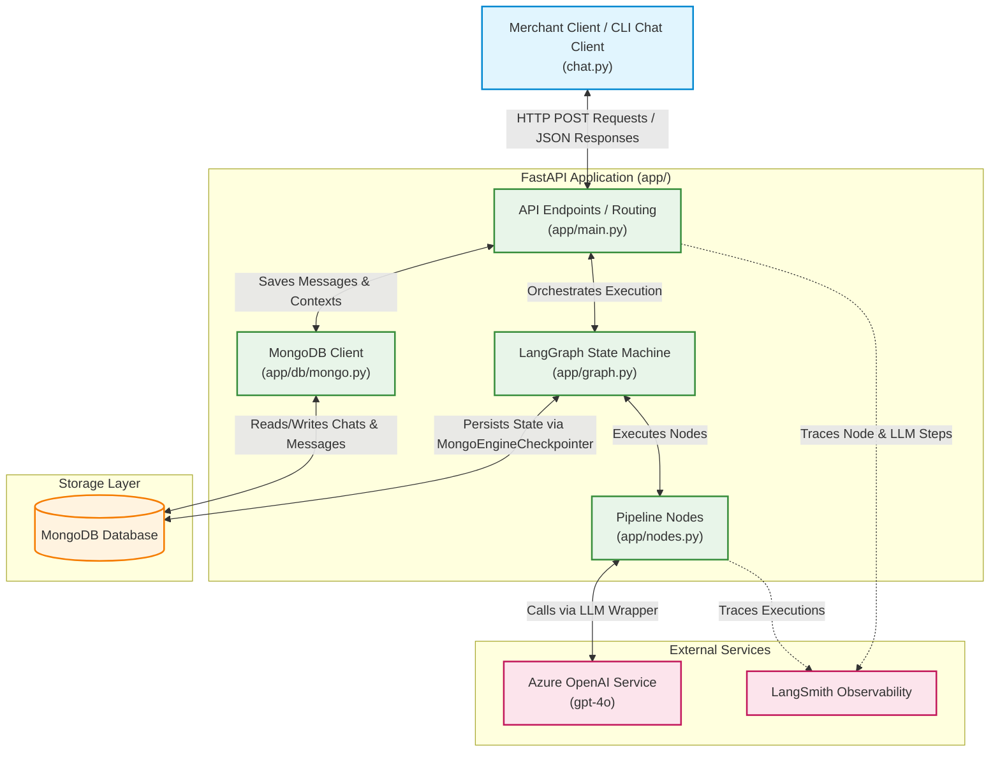
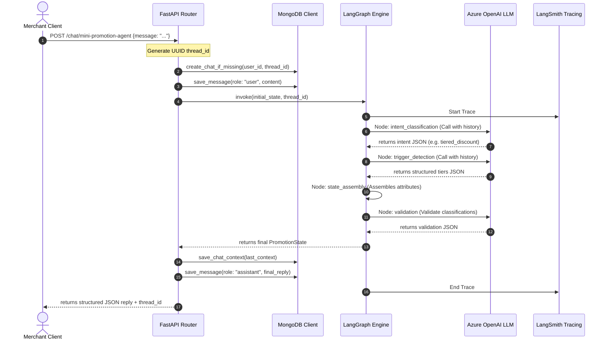
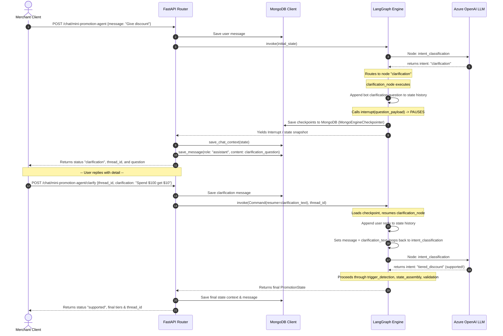

# High-Level Design (HLD)

This document provides a high-level architectural overview of the **Skailama Mini Promotion Agent** application. It describes the system boundary, component design, core data flows, and interactions between runtime modules.

---

## 🏗️ System Architecture

The Skailama system is built around a **FastAPI** web layer, a state-driven workflow engine powered by **LangGraph**, **MongoDB** for state and message persistence, and **Azure OpenAI** for processing natural language merchant inputs.

### Component Details

1. **Merchant Client (chat.py / Frontend)**: The interface where merchants enter promotion rules in natural language.
2. **FastAPI Web Server (app/main.py)**: Exposes endpoints to start conversations, resume paused conversations (clarification requests), and fetch message histories.
3. **LangGraph Pipeline (app/graph.py, app/nodes.py)**: Manages state compilation and steps (nodes). It is a Directed Acyclic Graph (DAG) with a conditional routing branch and a human-in-the-loop loopback cycle for clarifications.
4. **MongoEngineCheckpointer (app/mongo_checkpointer.py)**: LangGraph checkpointer integration that serializes and stores task writes and graph checkpoints in MongoDB.
5. **MongoDB Client (app/db/mongo.py)**: Manages chat metadata and history collections. It logs every message (human prompts and agent replies) to provide a rich API audit trail.
6. **Azure OpenAI (app/llm.py)**: Provides LLM execution for classification, parsing, and validation using gpt-4o.
7. **LangSmith Tracing**: Captures telemetry for performance analysis, prompt evaluation, and error tracing.

---

## 🔄 Core Interactions & Data Flow

### 1. Happy Path: Fully Supported Promotion

Below is the standard data flow for a well-formed promotion request (e.g., *"Spend $100 get 10% off"*).

---

### 2. Human-In-The-Loop: Clarification Request and Resume Flow

If the merchant supplies an ambiguous or incomplete promotion request, the system triggers a clarification process. This pauses the LangGraph execution using an **interrupt**, persists the thread state, and resumes it upon receiving input from the merchant.

