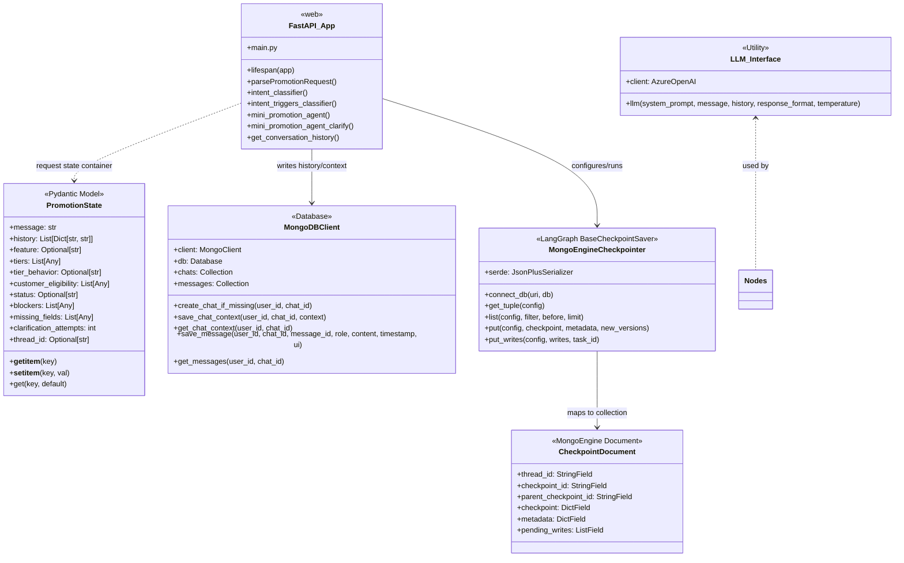

# Low-Level Design (LLD)

This document provides a low-level architectural specification of the modules, classes, and database schemas that make up the **Skailama Mini Promotion Agent**.

---

## 💻 Class & Module Structure

The interaction diagram below details the attributes, methods, and structural relationships of the key backend classes.

---

## 🗄️ Database Schemas

MongoDB holds the state, messages, and state checkpoints of the system. It features two database drivers: `pymongo` (standard client for raw chats/messages collections) and `mongoengine` (Object-Document Mapper for the checkpointing system).

### 1. `chats` Collection (Managed by `MongoDBClient`)
Maintains metadata regarding each distinct user-agent dialogue session.

| Field Name | Type | Description |
| :--- | :--- | :--- |
| `_id` | ObjectId | MongoDB internal document identifier |
| `user_id` | String | User ID reference (defaults to `"default_user"`) |
| `chat_id` | String | Unique thread ID generated as a UUID4 |
| `created_at` | String | ISO 8601 timestamp of creation |
| `updated_at` | String | ISO 8601 timestamp of last context update |
| `last_context`| Document | Nested dictionary matching the current `PromotionState` schema |

### 2. `messages` Collection (Managed by `MongoDBClient`)
Maintains individual dialogue lines (prompts, answers, system flags).

| Field Name | Type | Description |
| :--- | :--- | :--- |
| `_id` | ObjectId | MongoDB internal document identifier |
| `user_id` | String | User ID reference |
| `chat_id` | String | Thread ID reference |
| `message_id` | String | Unique UUID for the message |
| `role` | String | `"user"` (human) or `"assistant"` (bot replies) |
| `content` | String | Text body of the message (or text summary of bot answer) |
| `timestamp` | String | ISO 8601 timestamp |
| `ui` | Document | Optional nested fields (e.g. structured promotions, tiered discounts, or blockers) |

### 3. `checkpoints` Collection (Managed by `MongoEngineCheckpointer`)
Stores binary and typed serialized snapshots of LangGraph executions.

| Field Name | Type | Description |
| :--- | :--- | :--- |
| `thread_id` | String | Thread ID reference (unique index component) |
| `checkpoint_id`| String | LangGraph internal state step ID (unique index component) |
| `parent_checkpoint_id`| String | Ancestor state step ID (for timeline/history branching) |
| `checkpoint` | Document | Serialized state channel values & versions via `JsonPlusSerializer` |
| `metadata` | Document | Serialized checkpoint metadata (source, step type, parents) |
| `pending_writes`| Array | Serialization queue containing task IDs, channels, and pending write data |

---

## 📝 Configuration and Secrets (.env)

The server initializes its external client bindings from standard environment variables defined in the `.env` file:
* **Azure OpenAI Service**: Key (`OPENAI_API_4_KEY`), Version (`OPENAI_API_4_VERSION`), Base Endpoint (`OPENAI_4_BASE_URL`), Deployment Name (`OPEN_API_4_ENGINE`).
* **MongoDB**: Target URI (`MONGODB_URI`), database name (`MONGODB_DB_NAME`).
* **LangSmith**: Enable flag (`LANGCHAIN_TRACING_V2`), Endpoint (`LANGCHAIN_ENDPOINT`), Trace Key (`LANGCHAIN_API_KEY`), Project Name (`LANGCHAIN_PROJECT`).
