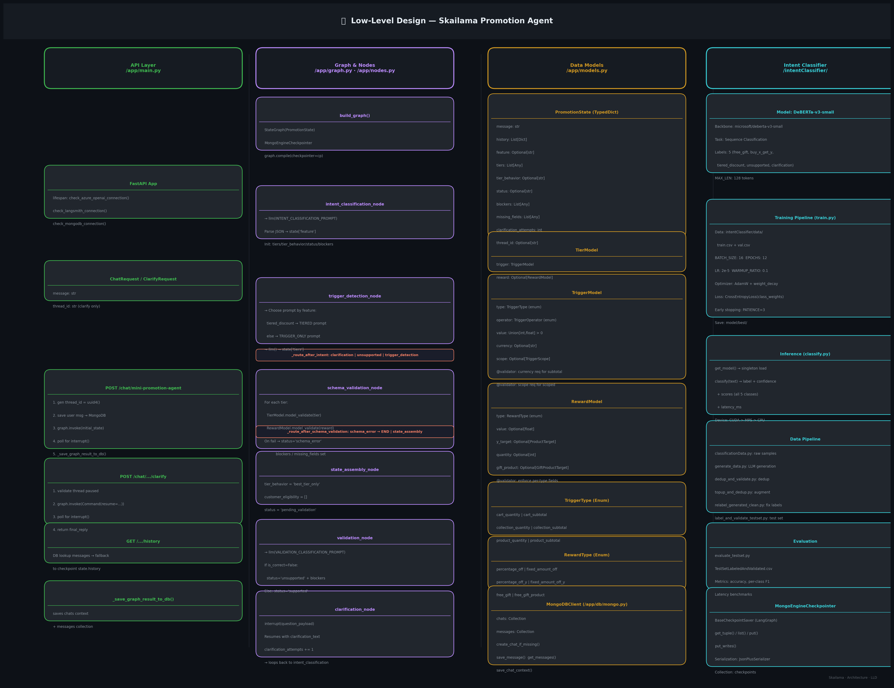

# Low-Level Design — Skailama Promotion Agent



## Column 1 — API Layer (`/app/main.py`)

### FastAPI Application
- **Lifespan startup hooks**: `check_azure_openai_connection()`, `check_langsmith_connection()`, `check_mongodb_connection()`
- `AzureOpenAI` client instantiated at module load from `.env`

### Request/Response Models
| Model | Fields |
|-------|--------|
| `ChatRequest` | `message: str` |
| `ClarifyRequest` | `thread_id: str`, `clarification: str` |

### POST `/chat/mini-promotion-agent`
1. Generate `thread_id = uuid4()` (server-owned)
2. `db_client.create_chat_if_missing()` + save user message
3. `graph.invoke(initial_state, config)`
4. Poll up to 10 × 100ms for interrupt detection
5. If interrupt → return `{status, blockers, question, thread_id}`
6. Else → build `final_reply` dict, call `_save_graph_result_to_db()`

### POST `/chat/mini-promotion-agent/clarify`
1. Verify thread is paused (`state_snapshot.next` non-empty)
2. `graph.invoke(Command(resume=clarification), config)`
3. Same interrupt polling loop as above

### GET `/{thread_id}/history`
- Primary: `db_client.get_messages()` from MongoDB
- Fallback: `graph.get_state(config).values["history"]`

---

## Column 2 — Graph & Nodes (`/app/graph.py`, `/app/nodes.py`)

### `build_graph()`
```python
StateGraph(PromotionState)
MongoEngineCheckpointer.connect_db()
graph.compile(checkpointer=MongoEngineCheckpointer())
```

### Node Details

| Node | Prompt Used | Key Output |
|------|-------------|-----------|
| `intent_classification_node` | `INTENT_CLASSIFICATION_PROMPT` | `state.feature` |
| `trigger_detection_node` | `TRIGGER_ONLY_CLASSIFICATION_PROMPT` or `TIERED_DISCOUNT_TRIGGER_ONLY_CLASSIFICATION_PROMPT` | `state.tiers` |
| `schema_validation_node` | *(Pydantic, no LLM)* | `status`, `blockers`, `missing_fields` |
| `state_assembly_node` | *(No LLM)* | `tier_behavior`, `customer_eligibility`, `status='pending_validation'` |
| `validation_node` | `VALIDATION_CLASSIFICATION_PROMPT` | `status='supported'` or `'unsupported'` |
| `clarification_node` | *(interrupt)* | Pauses; resumes with `clarification_text` |
| `unsupported_node` | *(No LLM)* | `status='unsupported'`, terminal |

### Routing Logic
```
intent_classification
  ├─ clarification  → clarification_node → loops back
  ├─ unsupported    → unsupported_node → END
  └─ supported      → trigger_detection → schema_validation
                            ├─ schema_error → END
                            └─ valid        → state_assembly → validation → END
```

---

## Column 3 — Data Models (`/app/models.py`)

### `PromotionState` (Pydantic BaseModel)
| Field | Type | Description |
|-------|------|-------------|
| `message` | `str` | Current user input |
| `history` | `List[Dict]` | Full conversation history |
| `feature` | `Optional[str]` | Classified intent |
| `tiers` | `List[Any]` | LLM-extracted tier objects |
| `tier_behavior` | `Optional[str]` | `"best_tier_only"` |
| `status` | `Optional[str]` | `supported/unsupported/schema_error/pending_validation/clarification` |
| `blockers` | `List[Any]` | Validation errors |
| `missing_fields` | `List[Any]` | Failed tier indices |
| `clarification_attempts` | `int` | Safety valve counter (max 3) |
| `thread_id` | `Optional[str]` | UUID owned by server |

### `TierModel`
```
TierModel
├── trigger: TriggerModel
│     ├── type: TriggerType  {cart_quantity, cart_subtotal, collection_*, product_*}
│     ├── operator: TriggerOperator  {>=, >, <=, <, =}
│     ├── value: Union[int, float]  (> 0)
│     ├── currency: Optional[str]   (required for *_subtotal)
│     └── scope: Optional[TriggerScope]  (required for collection_* / product_*)
└── reward: Optional[RewardModel]
      ├── type: RewardType
      ├── value: Optional[float]
      ├── y_target: Optional[ProductTarget]   (for *_off_y)
      ├── quantity: Optional[int]
      └── gift_product: Optional[GiftProductTarget]  (for free_gift)
```

### `RewardType` Enum
| Value | Category | Required Fields |
|-------|----------|----------------|
| `percentage_off` | Tiered | `value` |
| `fixed_amount_off` | Tiered | `value` |
| `percentage_off_y` | Buy X Get Y | `value`, `y_target`, `quantity` |
| `fixed_amount_off_y` | Buy X Get Y | `value`, `y_target`, `quantity` |
| `free_gift` | Free Gift | `gift_product`, `quantity` |
| `free_gift_product` | Free Gift (legacy) | `value` |

---

## Column 4 — Intent Classifier (`/intentClassifier/`)

### Model Architecture
- **Backbone**: `microsoft/deberta-v3-small` (HuggingFace Transformers)
- **Head**: `AutoModelForSequenceClassification` (5 classes)
- **Labels**: `free_gift`, `buy_x_get_y`, `tiered_discount`, `unsupported`, `clarification`

### Training (`train.py`)
| Hyperparameter | Value |
|---------------|-------|
| MAX_LEN | 128 tokens |
| BATCH_SIZE | 16 |
| EPOCHS | 12 |
| LR | 2e-5 |
| Optimizer | AdamW + weight_decay=0.01 |
| Loss | CrossEntropyLoss(class_weights) |
| Early stopping | PATIENCE=3 |
| Save dir | `model/best/` |

### Inference (`classify.py`)
- `get_model()` — lazy singleton load (CUDA > MPS > CPU)
- `classify(text)` → `{label, confidence, scores, latency_ms}`
- Supports CLI: `python classify.py "Buy 2 get 1 free" --verbose`

### Data Pipeline
| Script | Purpose |
|--------|---------|
| `classificationData.py` | Seed labeled samples |
| `generate_data.py` / `generate_and_append.py` | LLM-based augmentation |
| `dedup_and_validate.py` | Deduplication |
| `relabel_generated_clean.py` | Label correction |
| `label_and_validate_testset.py` | Test set labeling + LLM validation |
| `evaluate_testset.py` | Final evaluation metrics |

### `MongoEngineCheckpointer` (`/app/mongo_checkpointer.py`)
Implements `BaseCheckpointSaver` interface required by LangGraph:
| Method | Description |
|--------|-------------|
| `get_tuple(config)` | Fetch latest checkpoint for a thread |
| `list(config)` | Iterate all checkpoints most-recent-first |
| `put(config, checkpoint, metadata, ...)` | Upsert snapshot |
| `put_writes(config, writes, task_id)` | Append pending writes |
| Serializer | `JsonPlusSerializer` (same as MemorySaver) |
| Collection | `checkpoints` (indexes on `thread_id + checkpoint_id`) |
