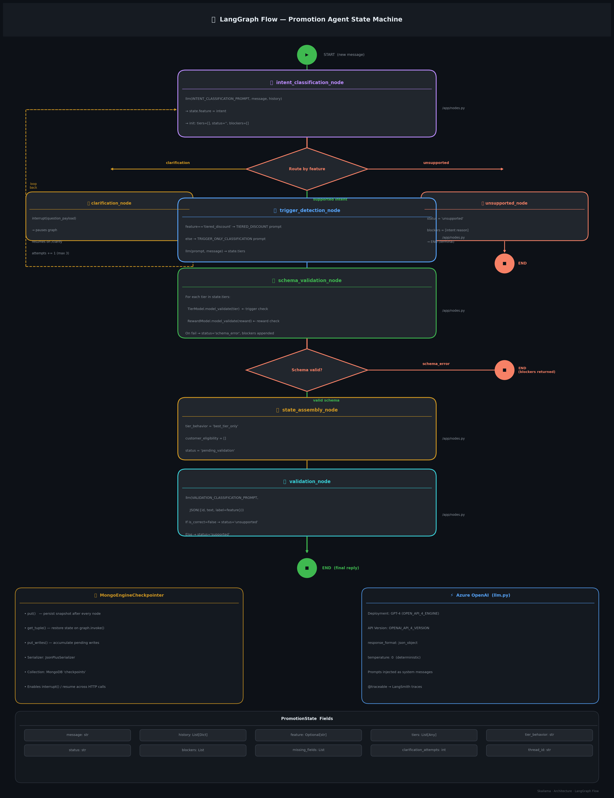

# LangGraph Flow — Skailama Promotion Agent



## State Machine Overview

The promotion agent is implemented as a **LangGraph `StateGraph`** with 7 nodes and 2 conditional routing points. All state is persisted in MongoDB via `MongoEngineCheckpointer`, enabling `interrupt()` / resume across separate HTTP calls.

---

## Complete Flow

```
START (new message)
    │
    ▼
[intent_classification_node]
  llm(INTENT_CLASSIFICATION_PROMPT, message, history)
  → state.feature = intent
  → init: tiers=[], status='', blockers=[]
    │
    ▼
◇ _route_after_intent ◇
  ├─ "clarification" ─────────────────────────────────────────────────────┐
  │                                                                        │
  │  [clarification_node]                                                  │
  │    interrupt(question_payload) ← pauses graph here                    │
  │    ← resumes via POST /clarify with Command(resume=text)              │
  │    clarification_attempts += 1 (max 3)                                │
  │    state.message = clarification_text                                  │
  │    loops back to intent_classification ───────────────────────────────┘
  │
  ├─ "unsupported" ──────────────────────────────────────────────────────▶ END
  │   [unsupported_node]
  │     status = 'unsupported'
  │     blockers = [intent reason]
  │
  └─ supported intent ──────────────────────────────────────────────────▼

[trigger_detection_node]
  feature == 'tiered_discount'
    → TIERED_DISCOUNT_TRIGGER_ONLY_CLASSIFICATION_PROMPT
  else
    → TRIGGER_ONLY_CLASSIFICATION_PROMPT
  llm(prompt, message) → state.tiers
    │
    ▼
[schema_validation_node]  ← no LLM, pure Pydantic
  For each tier in state.tiers:
    TierModel.model_validate(tier)          ← trigger check
    RewardModel.model_validate(reward)      ← reward check
  On any failure:
    status = 'schema_error'
    blockers = [{field, reason}, ...]
    missing_fields = ['tiers[i]', ...]
    │
    ▼
◇ _route_after_schema_validation ◇
  ├─ "schema_error" ────────────────────────────────────────────────────▶ END (blockers returned)
  │
  └─ "state_assembly" ──────────────────────────────────────────────────▼

[state_assembly_node]
  tier_behavior = 'best_tier_only'
  customer_eligibility = []
  status = 'pending_validation'
    │
    ▼
[validation_node]
  payload = JSON([{id, text=message, label=feature}])
  llm(VALIDATION_CLASSIFICATION_PROMPT, payload)
  If is_correct == False:
    status = 'unsupported'
    blockers = [{field: 'intent', reason: ...}]
  Else:
    status = 'supported'
    │
    ▼
  END  (final_reply returned to API caller)
```

---

## Node Reference

| Node | File | LLM | Prompt |
|------|------|-----|--------|
| `intent_classification_node` | `nodes.py` | ✅ | `INTENT_CLASSIFICATION_PROMPT` |
| `trigger_detection_node` | `nodes.py` | ✅ | `TRIGGER_ONLY_*` or `TIERED_DISCOUNT_*` |
| `schema_validation_node` | `nodes.py` | ❌ | Pydantic TierModel/RewardModel |
| `state_assembly_node` | `nodes.py` | ❌ | *(hardcoded values)* |
| `validation_node` | `nodes.py` | ✅ | `VALIDATION_CLASSIFICATION_PROMPT` |
| `clarification_node` | `nodes.py` | ❌ | `interrupt(question_payload)` |
| `unsupported_node` | `nodes.py` | ❌ | *(hardcoded response)* |

---

## Interrupt / Resume Mechanism

```
POST /chat/mini-promotion-agent
    │
    graph.invoke(initial_state, config={thread_id})
    │
    clarification_node calls interrupt(question_payload)
    │   ← graph pauses HERE, state persisted to MongoDB
    │
    API returns {status: "clarification", question: "...", thread_id: "..."}
    │
POST /chat/mini-promotion-agent/clarify
    │
    graph.invoke(Command(resume=clarification_text), config={thread_id})
    │   ← graph resumes from checkpoint, clarification_text flows back to node
    │
    clarification_node updates state.message = clarification_text
    │
    loops back to intent_classification_node
```

---

## `PromotionState` Fields

| Field | Type | Set By |
|-------|------|--------|
| `message` | `str` | API request / clarification_node |
| `history` | `List[Dict]` | intent_classification_node, clarification_node |
| `feature` | `Optional[str]` | intent_classification_node |
| `tiers` | `List[Any]` | trigger_detection_node |
| `tier_behavior` | `Optional[str]` | state_assembly_node |
| `customer_eligibility` | `List[Any]` | state_assembly_node |
| `status` | `Optional[str]` | multiple nodes |
| `blockers` | `List[Any]` | schema_validation_node, validation_node, clarification_node |
| `missing_fields` | `List[Any]` | schema_validation_node |
| `clarification_attempts` | `int` | clarification_node |
| `thread_id` | `Optional[str]` | API layer (server-owned) |

---

## MongoEngineCheckpointer

Every node transition calls `put()` to snapshot the current state in the `checkpoints` MongoDB collection. This enables:
- **`interrupt()` persistence** — graph can pause mid-node and resume in a later HTTP call
- **Conversation replay** — `get_tuple()` restores exactly where the graph left off
- **Audit trail** — `list()` provides ordered checkpoint history per thread
